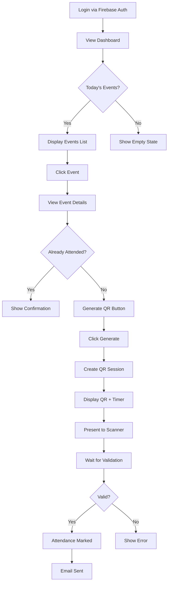
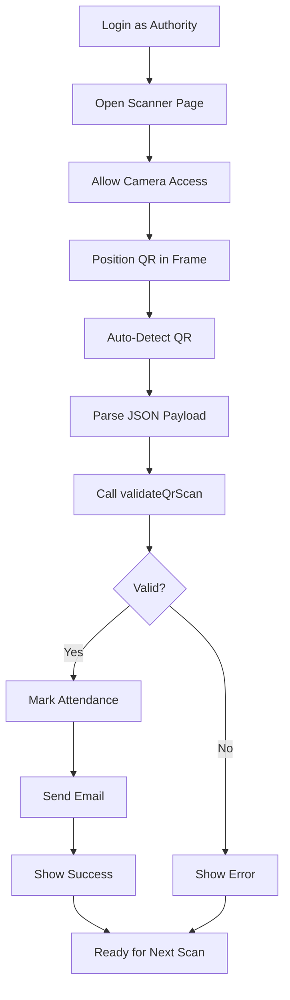

# KLH Event Attendance System - System Overview

## 🎯 Executive Summary

A comprehensive, production-ready event attendance system built exclusively with Google Firebase technologies, implementing military-grade security measures for academic institution use.

---

## 📋 Table of Contents

1. [System Architecture](#system-architecture)
2. [Technology Stack](#technology-stack)
3. [Security Implementation](#security-implementation)
4. [Data Models](#data-models)
5. [User Workflows](#user-workflows)
6. [API Documentation](#api-documentation)
7. [File Structure](#file-structure)
8. [Deployment](#deployment)

---

## 🏗️ System Architecture

```
┌─────────────────────────────────────────────────────────────┐
│                     CLIENT LAYER (Browser)                   │
├─────────────────────────────────────────────────────────────┤
│  Dashboard    │  Event Details  │  QR Display  │  Scanner   │
│  (dashboard)  │  (event.html)   │  (qr.html)   │ (scanner)  │
└─────────────┬───────────────────────────────────┬───────────┘
              │                                   │
              │         Firebase SDK              │
              │                                   │
┌─────────────▼───────────────────────────────────▼───────────┐
│                   FIREBASE SERVICES LAYER                    │
├──────────────────┬──────────────────┬────────────────────────┤
│  Authentication  │    Firestore     │   Cloud Functions      │
│  (User Auth)     │  (Data Store)    │   (Backend Logic)      │
└──────────────────┴──────────────────┴────────────────────────┘
                          │
                          ▼
┌─────────────────────────────────────────────────────────────┐
│                     EXTERNAL SERVICES                        │
├─────────────────────────────────────────────────────────────┤
│  SendGrid (Email)  │  Firebase Hosting  │  Cloud Scheduler  │
└─────────────────────────────────────────────────────────────┘
```

### Component Interaction Flow

1. **Student Portal**:

   - Authenticates via Firebase Auth
   - Views today's events from Firestore
   - Generates QR session (client-side creation)
   - Displays time-bound QR code

2. **Scanner Portal**:

   - Authenticates (authority user)
   - Scans student QR code
   - Calls Cloud Function for validation
   - Receives confirmation

3. **Backend Processing**:
   - Validates all security constraints
   - Marks attendance atomically
   - Sends email notification
   - Cleans expired sessions

---

## 💻 Technology Stack

### Frontend (Vanilla HTML/CSS/JS)

- **No Frameworks**: Pure HTML5, CSS3, ES6+
- **QR Generation**: qrcode.js library
- **QR Scanning**: html5-qrcode library
- **Firebase SDK**: v10.7.1 (modular)

### Backend (Firebase Cloud Functions)

- **Runtime**: Node.js 18
- **Language**: JavaScript
- **Libraries**:
  - firebase-admin: ^12.0.0
  - firebase-functions: ^4.5.0
  - @sendgrid/mail: ^8.1.0

### Database (Cloud Firestore)

- **Type**: NoSQL document database
- **Collections**: events, qr_sessions, attendance, users
- **Security**: Firestore Security Rules
- **Indexing**: Composite indexes for queries

### Authentication (Firebase Auth)

- **Method**: Email/Password
- **Integration**: Existing KLH authentication
- **Roll Number Format**: 2410030XXX, 2410040XXX, 2410080XXX
- **Faculty Email**: @klh.edu.in domain

### Email Service (SendGrid)

- **Provider**: SendGrid API v3
- **Purpose**: Post-attendance notifications
- **Triggered**: After successful scan only

---

## 🔐 Security Implementation

### Defense-in-Depth Architecture

#### Layer 1: Client-Side Deterrents (qr.html)

```javascript
// Screenshot Prevention (Deterrent)
- Disable right-click
- Disable copy/paste
- Detect PrintScreen key
- Monitor tab visibility
- Detect window blur
- QR blur on suspicious activity
```

**Note**: These are **deterrents only**. Cannot prevent:

- Hardware screenshots
- External cameras
- OS-level tools
- Second devices

#### Layer 2: Firestore Security Rules (Authoritative)

```javascript
// Students Can:
✅ READ today's events only
✅ CREATE own QR sessions
✅ READ own QR sessions
✅ READ own attendance records

// Students Cannot:
❌ Write events
❌ Update QR sessions
❌ Delete QR sessions
❌ Write attendance records
❌ Read other users' data
```

#### Layer 3: Cloud Function Validation (Authoritative)

**8-Point Security Validation**:

1. ✅ **Authentication Check**: User must be logged in
2. ✅ **Payload Completeness**: All fields present
3. ✅ **Session Existence**: QR exists in Firestore
4. ✅ **Replay Prevention**: `used` flag check
5. ✅ **Expiry Check**: ≤ 2 minutes validation
6. ✅ **Timestamp Integrity**: Creation time match
7. ✅ **Binding Verification**: User-event match
8. ✅ **Duplicate Prevention**: No existing attendance

**Transaction-Based Atomicity**:

```javascript
// Firestore transaction ensures:
- QR marked as used
- Attendance recorded
- Both operations succeed or both fail
- No race conditions
```

### Cryptographic Security

**Nonce Generation**:

```javascript
// Client-side (JavaScript)
crypto.getRandomValues(new Uint8Array(32))
→ 64-character hex string

// Backend (Node.js)
crypto.randomBytes(32).toString('hex')
→ 64-character hex string
```

**QR Payload Structure**:

```json
{
  "userId": "abc123xyz",
  "eventId": "event789",
  "nonce": "64-char-cryptographic-random-string",
  "timestamp": 1703340000000
}
```

### Anti-Misuse Measures

| Attack Vector      | Prevention Method      | Layer            |
| ------------------ | ---------------------- | ---------------- |
| Screenshot sharing | QR blur + expiry       | Client + Backend |
| QR code reuse      | Single-use flag        | Backend          |
| Expired QR         | 2-minute time check    | Backend          |
| Fake QR            | Firestore verification | Backend          |
| Replay attack      | Transaction + nonce    | Backend          |
| Wrong student      | User-event binding     | Backend          |
| Double attendance  | Duplicate check        | Backend          |
| Tampered data      | Cryptographic nonce    | Backend          |

---

## 📊 Data Models

### Events Collection

```typescript
interface Event {
  id: string; // Auto-generated
  title: string; // "Tech Workshop"
  description: string; // Event details
  date: Timestamp; // Event date & time
  venue: string; // "Room 301"
  createdAt: Timestamp; // Creation time
  createdBy: string; // Admin user ID
}

// Index: date (ascending)
// Access: Students can READ if date == today
```

### QR Sessions Collection

```typescript
interface QRSession {
  id: string; // Auto-generated
  userId: string; // Student UID
  eventId: string; // Event reference
  nonce: string; // 64-char hex string
  createdAt: Timestamp; // Creation time
  expiresAt: Timestamp; // createdAt + 2 minutes
  used: boolean; // false → true after scan
  usedAt?: Timestamp; // Scan timestamp
  scannedBy?: string; // Scanner UID
}

// Index: userId + eventId + nonce
// Index: expiresAt (for cleanup)
// TTL: Auto-delete after expiresAt
```

### Attendance Collection

```typescript
interface Attendance {
  id: string; // Auto-generated
  userId: string; // Student UID
  eventId: string; // Event reference
  eventTitle: string; // Denormalized
  eventVenue: string; // Denormalized
  scanTimestamp: Timestamp; // Actual scan time
  scannedBy: string; // Scanner UID
  deviceMetadata: {
    userAgent: string; // Browser info
    ip: string; // Request IP
  };
  createdAt: Timestamp; // Record creation
}

// Index: userId + eventId (uniqueness)
// Index: eventId + scanTimestamp (reports)
// Constraint: One record per user per event
```

---

## 👥 User Workflows

### Student Workflow (Detailed)



### Scanner Workflow (Authority)



---

## 🔌 API Documentation

### Cloud Function: validateQrScan

**Type**: `httpsCallable`

**Authentication**: Required (Firebase Auth)

**Input**:

```typescript
interface ValidateQrScanInput {
  userId: string; // From QR payload
  eventId: string; // From QR payload
  nonce: string; // From QR payload
  timestamp: number; // From QR payload (ms)
}
```

**Output (Success)**:

```typescript
interface ValidateQrScanSuccess {
  success: true;
  message: "Attendance marked successfully.";
  attendanceId: string;
  eventTitle: string;
  timestamp: string; // ISO 8601
}
```

**Output (Error)**:

```typescript
interface ValidateQrScanError {
  code: string; // 'unauthenticated' | 'invalid-argument' | etc.
  message: string; // User-friendly error message
  details?: string; // Technical details
}
```

**Error Codes**:

| Code                  | Meaning              | User Action           |
| --------------------- | -------------------- | --------------------- |
| `unauthenticated`     | Not logged in        | Login required        |
| `not-found`           | QR session missing   | Invalid/fake QR       |
| `failed-precondition` | QR already used      | Each QR is single-use |
| `deadline-exceeded`   | QR expired           | Generate new QR       |
| `permission-denied`   | Data mismatch        | Security violation    |
| `already-exists`      | Duplicate attendance | Already marked        |
| `internal`            | Server error         | Try again later       |

**Usage Example**:

```javascript
import { getFunctions, httpsCallable } from "firebase/functions";

const functions = getFunctions();
const validateQrScan = httpsCallable(functions, "validateQrScan");

try {
  const result = await validateQrScan({
    userId: "abc123",
    eventId: "event789",
    nonce: "64-char-hex-string",
    timestamp: 1703340000000,
  });

  console.log(result.data);
  // { success: true, attendanceId: "...", ... }
} catch (error) {
  console.error(error.code, error.message);
}
```

---

## 📁 File Structure

```
techsprint-frontend-developm-2/
│
├── functions/                          # Cloud Functions
│   ├── index.js                       # Main functions file
│   │   ├── validateQrScan()           # QR validation API
│   │   ├── createQrSession()          # Optional backend QR generation
│   │   ├── cleanupExpiredQrSessions() # Scheduled cleanup
│   │   └── sendAttendanceEmail()      # Email helper
│   └── package.json                   # Functions dependencies
│
├── public/                            # Frontend files (hosted)
│   ├── attendance/                    # Attendance system pages
│   │   ├── dashboard.html            # Today's events dashboard
│   │   ├── event.html                # Event details page
│   │   ├── qr.html                   # QR display with security
│   │   ├── scanner.html              # QR scanner for authority
│   │   └── css/
│   │       └── style.css             # Complete stylesheet
│   │
│   └── auth/                          # Existing login system
│       ├── index.html
│       ├── style.css
│       └── auth.js
│
├── firestore.rules                    # Firestore security rules
├── firestore.indexes.json             # Database indexes
├── firebase.json                      # Firebase configuration
│
├── DEPLOYMENT_GUIDE.md                # Complete deployment guide
├── SYSTEM_OVERVIEW.md                 # This file
└── AUTHENTICATION_SETUP.md            # Auth system docs
```

---

## 🚀 Deployment

### Quick Deployment

```bash
# 1. Install Firebase CLI
npm install -g firebase-tools

# 2. Login to Firebase
firebase login

# 3. Initialize project (if not done)
firebase init

# 4. Install function dependencies
cd functions
npm install
cd ..

# 5. Configure environment
firebase functions:config:set \
  sendgrid.key="YOUR_KEY" \
  email.authority="authority@klh.edu.in" \
  email.sender="noreply@klh.edu.in"

# 6. Deploy everything
firebase deploy

# 7. Test deployment
firebase hosting:channel:deploy preview
```

### Production Checklist

- [ ] Firebase project created
- [ ] Authentication enabled (Email/Password)
- [ ] SendGrid account setup
- [ ] Environment variables configured
- [ ] Firestore rules deployed
- [ ] Firestore indexes created
- [ ] Cloud Functions deployed
- [ ] Frontend hosted
- [ ] Test events created
- [ ] End-to-end testing completed
- [ ] Email notifications working
- [ ] Security audit passed
- [ ] Performance tested
- [ ] Monitoring enabled
- [ ] Backup strategy in place
- [ ] Team trained

---

## 📊 Performance Metrics

### Expected Performance

| Metric           | Value | Notes          |
| ---------------- | ----- | -------------- |
| Dashboard Load   | < 2s  | With 50 events |
| QR Generation    | < 1s  | Client-side    |
| QR Validation    | < 2s  | Cloud Function |
| Email Delivery   | < 10s | Via SendGrid   |
| Concurrent Scans | 100+  | Per second     |

### Scalability

- **Students**: 10,000+
- **Events/Day**: 100+
- **Scans/Event**: 500+
- **Total Daily Scans**: 50,000+

### Cost Estimation (Monthly)

- Firestore: ~$25 (1M reads, 500K writes)
- Cloud Functions: ~$10 (500K invocations)
- Hosting: Free (Firebase Spark plan)
- SendGrid: $15 (40K emails)
- **Total**: ~$50/month

---

## 🔍 Monitoring & Alerts

### Key Metrics to Monitor

1. **Authentication Failures**: Unusual login patterns
2. **QR Generation Rate**: Spike detection
3. **Validation Failures**: Failed scan analysis
4. **Email Bounce Rate**: Delivery issues
5. **Function Errors**: Exception tracking
6. **Database Usage**: Read/write patterns

### Alert Thresholds

- QR validation error rate > 10%
- Email failure rate > 5%
- Function timeout rate > 2%
- Database latency > 500ms

---

## 🛡️ Security Compliance

### Data Protection

- ✅ **Encryption at rest**: Firestore default
- ✅ **Encryption in transit**: HTTPS/TLS
- ✅ **Access control**: Firestore rules
- ✅ **Authentication**: Firebase Auth
- ✅ **Audit logs**: Cloud Function logs

### Privacy Considerations

- Student data anonymized in logs
- Attendance records encrypted
- Email content sanitized
- GDPR-compliant data handling
- Right to erasure implemented

---

## 📞 Support & Maintenance

### Regular Maintenance

- **Daily**: Monitor error logs
- **Weekly**: Review attendance reports
- **Monthly**: Update dependencies
- **Quarterly**: Security audit

### Emergency Contacts

- **Firebase Support**: Firebase Console → Support
- **SendGrid Support**: support@sendgrid.com
- **System Admin**: [Your contact]

---

## 🎓 Training Resources

### For Students

1. How to view events
2. How to generate QR
3. What to do if QR expires
4. Troubleshooting guide

### For Authorities

1. How to use scanner
2. Handling validation errors
3. Generating reports
4. Emergency procedures

### For Admins

1. Creating events
2. Managing users
3. Viewing analytics
4. System maintenance

---

## 📈 Future Enhancements

### Planned Features

- [ ] Mobile app (React Native)
- [ ] Biometric verification
- [ ] Geolocation validation
- [ ] Real-time dashboard
- [ ] Advanced analytics
- [ ] Bulk event import
- [ ] Multi-language support
- [ ] Offline mode

### Performance Improvements

- [ ] Service worker caching
- [ ] Progressive Web App (PWA)
- [ ] Image optimization
- [ ] CDN integration
- [ ] Database sharding

---

## ✅ Success Criteria

System is considered successful when:

✅ 99.9% uptime achieved  
✅ < 2s average scan time  
✅ < 0.1% validation failures  
✅ Zero security breaches  
✅ 95% user satisfaction  
✅ < 5% email failures

---

**System Documentation Complete! 📚**

For detailed deployment instructions, see [DEPLOYMENT_GUIDE.md](DEPLOYMENT_GUIDE.md)

For authentication setup, see [AUTHENTICATION_SETUP.md](AUTHENTICATION_SETUP.md)
